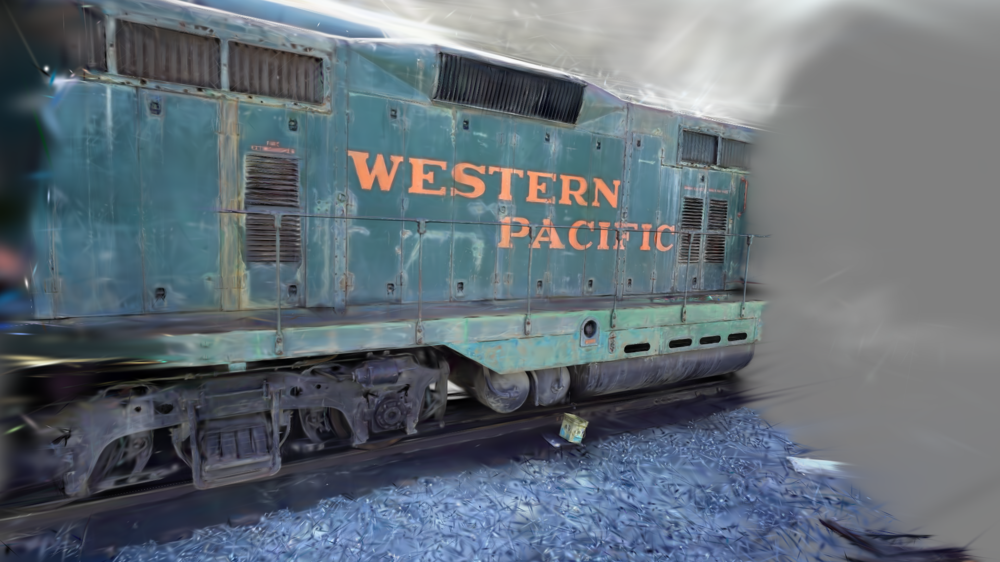

# 3D Gaussian Splatting - CuPy Implementation

English | [中文文档](documents/README_zh.md)

<p align="center">
  <i>A clean and understandable 3D Gaussian Splatting inference implementation</i>
</p>

## 🎯 Purpose

This is a **CuPy-based inference implementation** of 3D Gaussian Splatting, designed to provide a clean and easy-to-understand codebase that helps developers deeply understand the core rendering principles of 3DGS.

<p align="center">
  
  <br>
  <i>Rendering result: Train scene rendered using this project</i>
</p>

## 📊 Comparison with Original Implementation

| Feature | This Implementation                 | Original CUDA Implementation |
|---------|-------------------------------------|------------------------------|
| Language | Python + CuPy                       | C++ + CUDA |
| Functionality | Inference only                      | Training + Inference |
| Code Size | ~800 lines                          | ~5000+ lines |
| Dependencies | cupy, numpy, opencv-python, plyfile           | Complex compilation environment |
| Test Cases | 6 progressive test scenes           | No unit tests |
| Readability | ⭐⭐⭐⭐⭐                               | ⭐⭐⭐ |
| Use Case | Learning & understanding algorithms | Production & model training |

## 🚀 Quick Start

### 1. Install Dependencies
```bash
pip install -r requirements.txt
```

### 2. Download Pre-trained Scene Data

Download the pre-trained train scene (including trained PLY file) from the official 3DGS project:
```bash
# Download pre-trained models (~14GB)
wget https://repo-sam.inria.fr/fungraph/3d-gaussian-splatting/datasets/pretrained/models.zip
unzip models.zip

# After extraction, find the train scene point cloud file:
# train/point_cloud/iteration_30000/point_cloud.ply
# Place it in the project's data/train/point_cloud/iteration_30000/ directory
```

### 3. Prepare Test Data
```bash
cd test
python 06_generate_train_scene_test.py
```

### 4. Run Rendering
```bash
python pipeline.py
```

After rendering completes, **`output.png`** will be generated in the project root directory.

## 📚 References

This implementation is based on the following paper and code:

- [3D Gaussian Splatting for Real-Time Radiance Field Rendering](https://repo-sam.inria.fr/fungraph/3d-gaussian-splatting/)
- [Official GitHub Implementation](https://github.com/graphdeco-inria/gaussian-splatting)
- [Official CUDA Rasterization Implementation](https://github.com/graphdeco-inria/diff-gaussian-rasterization)

## 🤝 Contributing

Issues and Pull Requests are welcome! Especially:
- Performance optimization suggestions
- More test scenes
- Documentation improvements

## 📝 License

This project is licensed under the MIT License.

---

<p align="center">
  <b>If this project helped you understand 3D Gaussian Splatting, please give it a ⭐️ Star!</b>
</p>